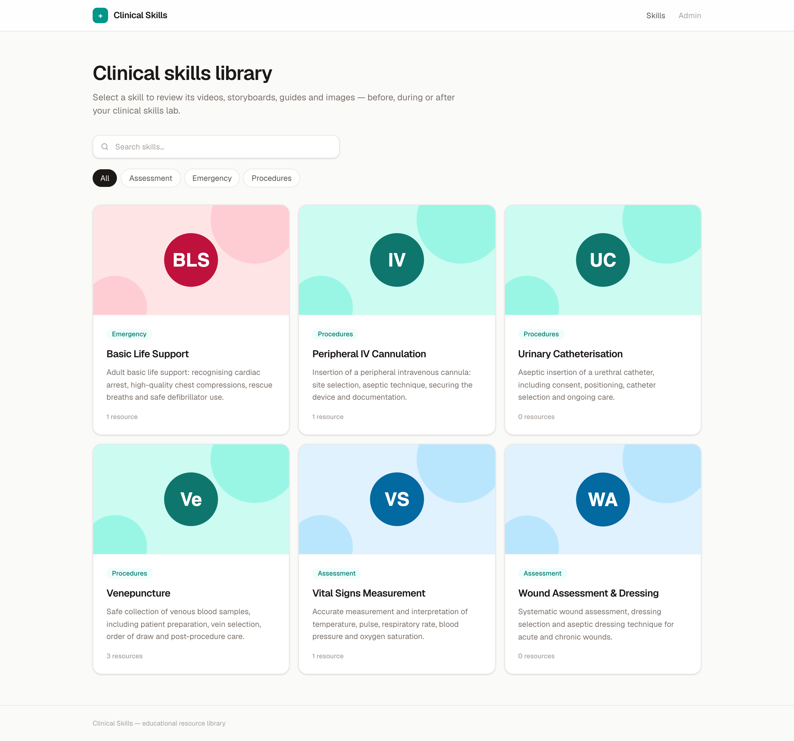
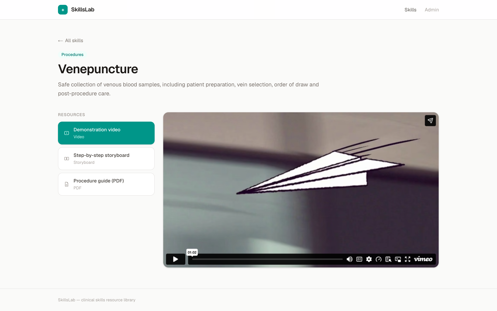
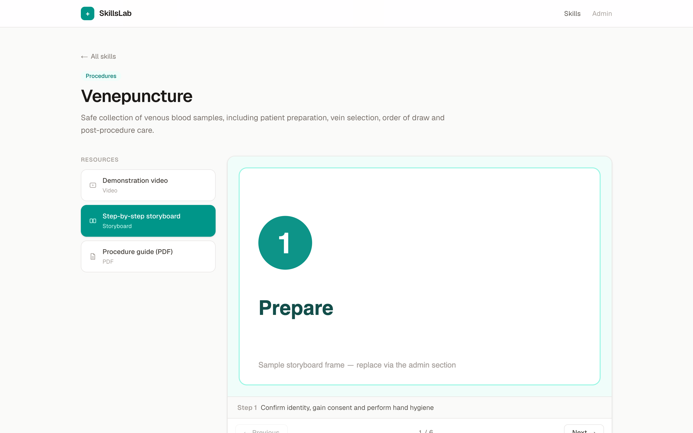
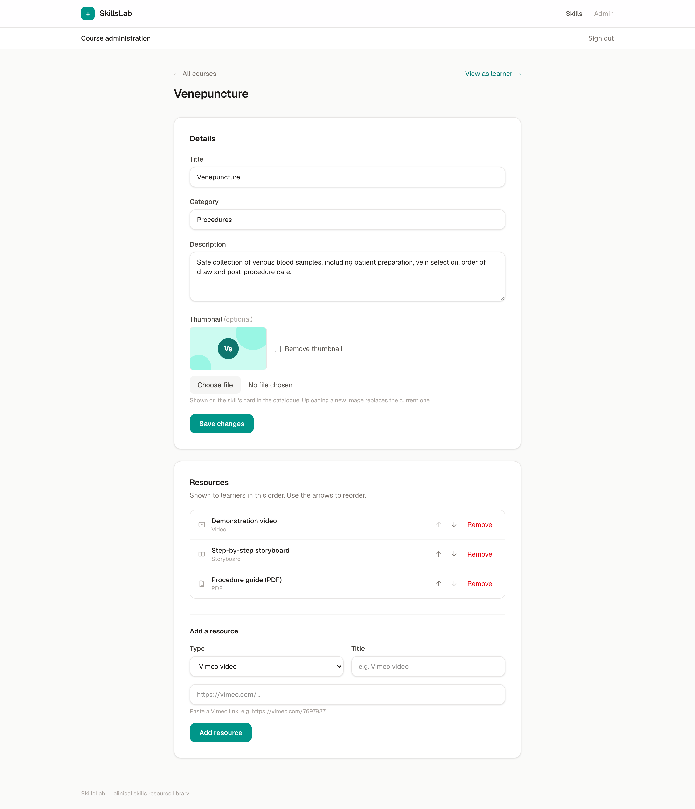
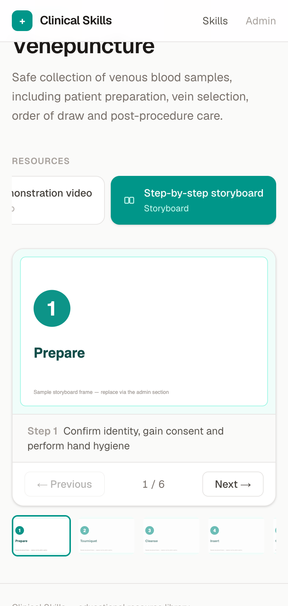

# SkillsLab

A clean, fast, responsive web app for delivering procedural clinical skills educational
materials — PDFs, images, step-by-step storyboards and embedded Vimeo videos. Learners pick a
skill and review its resources before, during or after the clinical skills lab; administrators
manage courses through a simple admin section.

## Screenshots

**Skill catalogue** — searchable, filterable by category, with per-skill thumbnails:



**Resource viewer** — embedded Vimeo videos and step-through storyboards with captions
(plus inline PDFs and images):

<p>
  
  
</p>

**Admin section & mobile** — password-protected course management (details, thumbnail,
uploads, Vimeo links, reordering), and the same viewer on a phone:

<p>
  
  
</p>

## Stack

- **Next.js** (App Router, TypeScript, React Server Components + Server Actions)
- **Tailwind CSS** for a minimalist, fully responsive UI (desktop / tablet / mobile)
- **SQLite** (`better-sqlite3`) — zero-setup local database stored in `data/app.db`
- Uploaded files stored in `data/uploads/` and served via `/files/…`

## Getting started

```bash
npm install
npm run dev
```

Open http://localhost:3000. The database is created and seeded with example skills on first
run — replace them with your own content via the admin section.

### Admin section

Go to **/admin** (also linked in the header). The password is set in `.env.local`:

```
ADMIN_PASSWORD=clinical-admin   # change this before deploying
```

From the admin section you can:

- add, edit and remove skills (courses), including an optional card thumbnail
- upload PDFs and images
- build storyboards from multiple images with a caption per step (shown to learners as a
  step-through sequence)
- attach Vimeo videos by pasting the video URL (private links with a hash are supported)
- reorder the resources shown for each skill

Uploads through the admin section are limited to 50 MB per submission (configured via
`experimental.serverActions.bodySizeLimit` in `next.config.ts`).

### Production

```bash
npm run build
npm start
```

### Docker

Pushes to `main` (and `v*` tags) publish a multi-arch image to GitHub Container Registry
via `.github/workflows/docker.yml`. The shipped `compose.yaml` pulls that prebuilt image,
so you can deploy without cloning the repo — grab the file and start it:

```bash
curl -fsSL https://raw.githubusercontent.com/authorTom/skillslab/main/compose.yaml -o compose.yaml
ADMIN_PASSWORD=change-me docker compose up -d
```

`compose.yaml` persists `data/` in a named volume, runs an `init` process, and includes a
healthcheck. It references `ghcr.io/authortom/skillslab:latest`, so `docker compose pull`
fetches new versions.

To build from source instead of pulling (multi-stage `Dockerfile`, Next.js standalone
output, runs as a non-root user):

```bash
docker build -t skillslab .
docker run -d -p 3000:3000 -e ADMIN_PASSWORD=change-me \
  -v skillslab-data:/app/data skillslab
```

When backing up a containerised deployment, snapshot the `/app/data` volume (e.g.
`docker run --rm -v skillslab-data:/data -v "$PWD":/backup alpine tar czf /backup/data.tgz /data`).

### Backups

Everything lives in `data/` (SQLite database + uploaded files). To snapshot it into
`backups/<timestamp>/` — safe to run while the app is serving:

```bash
npm run backup
```

The 14 most recent snapshots are kept. To run nightly at 02:00 via cron:

```
0 2 * * * cd /path/to/skillslab && /usr/local/bin/npm run backup
```

## Project layout

| Path | Purpose |
| --- | --- |
| `src/app/page.tsx` | Skill catalogue with search and category filters |
| `src/app/skills/[slug]/page.tsx` | Skill detail page with the resource viewer |
| `src/components/ResourceViewer.tsx` | PDF viewer, image lightbox, storyboard stepper, Vimeo embed |
| `src/app/admin/` | Admin section: login, course list, skill editor |
| `src/app/admin/actions.ts` | Server actions: auth, skill CRUD, uploads |
| `src/app/files/[...path]/route.ts` | Serves uploaded files from `data/uploads` |
| `src/lib/db.ts` | SQLite schema + first-run seed data |
| `src/lib/data.ts` | Typed query/CRUD helpers |
| `data/` | Database and uploads (git-ignored — back this up) |
