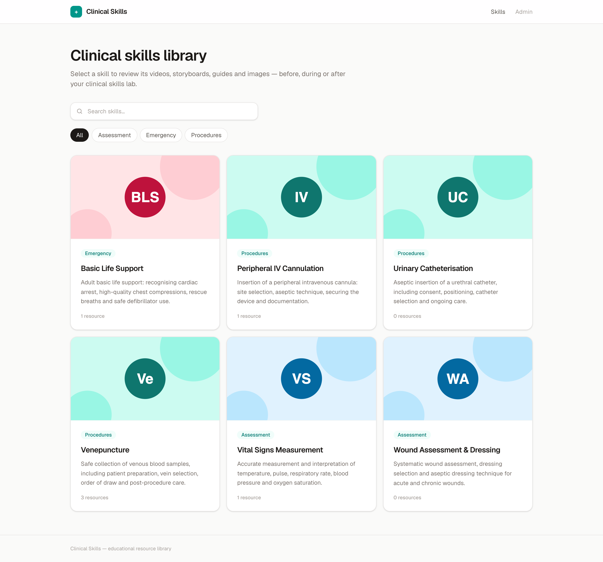
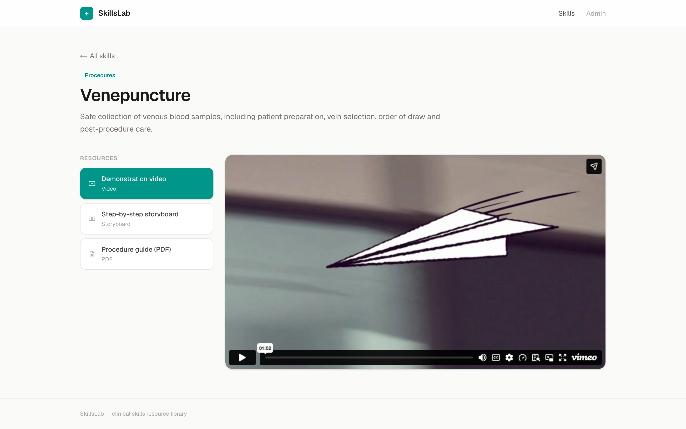
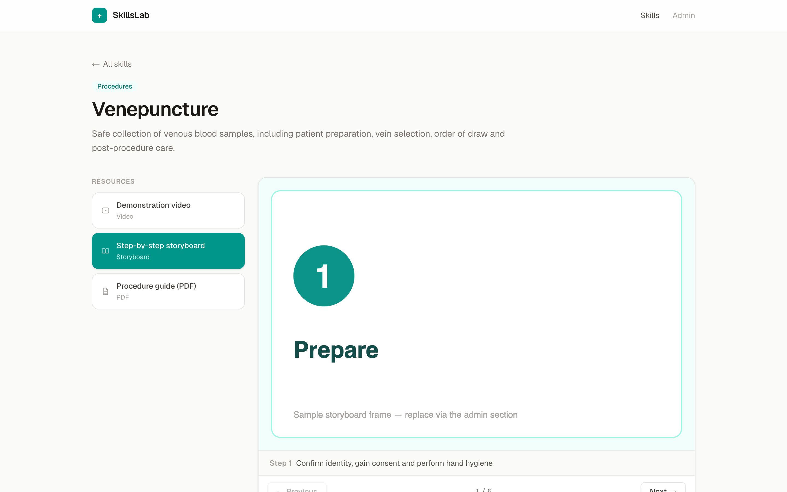
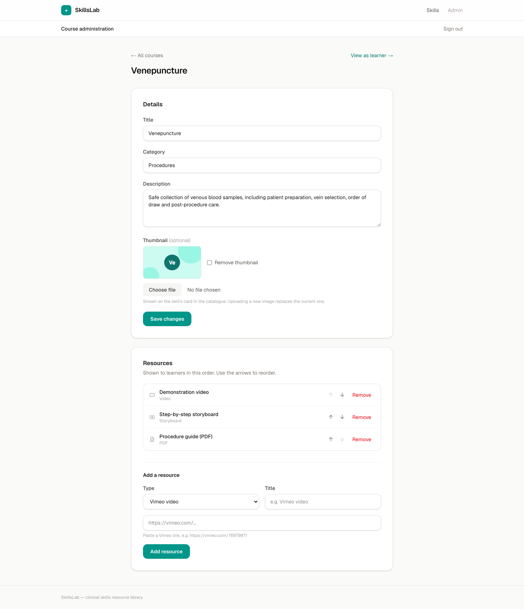
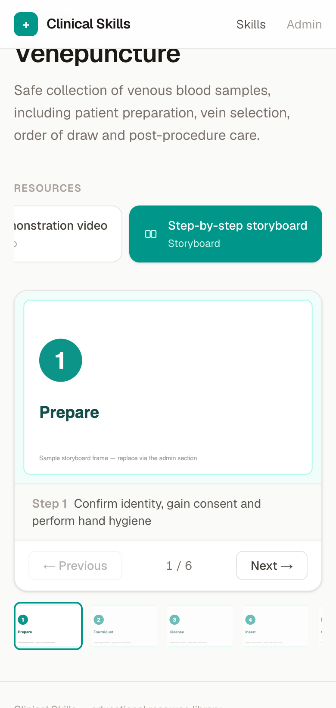

# SkillsLab

**A clean, fast, responsive web app for delivering procedural clinical skills
educational materials.**

PDFs, images, step-by-step storyboards and embedded Vimeo videos. Learners pick
a skill and review its resources before, during or after the clinical skills
lab; administrators manage courses through a simple admin section.



| Resource viewer — embedded video | Storyboards — step-by-step with captions |
| --- | --- |
|  |  |
| **Admin section — course management** | **The same viewer on a phone** |
|  |  |

## Why it exists

Clinical skills teaching material tends to end up scattered: a PDF on a shared
drive, a video on someone's Vimeo account, a photo sequence in a PowerPoint that
only opens properly on one machine. Students ask where the guide is, and the
answer is different every time.

SkillsLab gives each skill one address holding everything for it — the video,
the guide, the step-by-step photos — that works on a phone at the bedside as
well as on a desktop. There is no learner account to create and nothing to log
in to: a student opens the link and reads.

It is deliberately small. There is no assessment, no progress tracking and no
LMS integration; it is a well-organised library, not a learning platform.

## What it does

- **Skill catalogue** — searchable, filterable by group and category, with a
  thumbnail per skill.
- **Resource viewer** — inline PDFs, an image lightbox, step-through storyboards
  with a caption per step, and embedded Vimeo videos (private links with a hash
  are supported).
- **Admin section** — password-protected course management: add, edit and remove
  skills, organise them into groups and categories, upload PDFs and images,
  build storyboards, attach Vimeo videos by pasting the URL, and reorder the
  resources shown for each skill.
- **Media library** — every upload in one place, shared between courses: folders,
  tags, search, rename, replace, and a picker on every form.
- **Nothing lost by accident** — resources stay editable after they are added,
  and deletions go to a recycle bin.
- **Responsive** — desktop, tablet and mobile, built minimalist throughout.
- **Zero setup** — the database is created and seeded with example skills on
  first run.

## Run it

### With Docker (recommended)

Pushes to `main` (and `v*` tags) publish a multi-arch image to GitHub Container
Registry. The shipped `compose.yaml` pulls that prebuilt image, so you can
deploy without cloning the repo:

```bash
curl -fsSL https://raw.githubusercontent.com/authorTom/skillslab/main/compose.yaml -o compose.yaml
ADMIN_PASSWORD=change-me docker compose up -d
```

Open **<http://localhost:3000>**, then go to **/admin** and sign in with that
password to replace the seeded example skills with your own.

Rather than passing `ADMIN_PASSWORD` on the command line, drop a `.env` file
next to `compose.yaml` (copy [`.env.example`](.env.example) and edit it) —
compose reads it automatically. Keep that `.env` out of version control.

`compose.yaml` persists `data/` in a named volume, runs an `init` process, and
includes a healthcheck. `docker compose pull` fetches new versions.

To build from source instead of pulling (multi-stage `Dockerfile`, Next.js
standalone output, runs as a non-root user):

```bash
docker build -t skillslab .
docker run -d -p 3000:3000 -e ADMIN_PASSWORD=change-me \
  -v skillslab-data:/app/data skillslab
```

### From source

```bash
npm install
npm run dev
```

Open <http://localhost:3000>. The database is created and seeded with example
skills on first run.

For production: `npm run build && npm start`.

## Configuration

| Variable | Default | What it does |
| --- | --- | --- |
| `ADMIN_PASSWORD` | *(required)* | Password for the admin section. The server will not start without it, and rejects known-weak defaults. |

Set it in `.env.local` for local development, or a `.env` beside `compose.yaml`
for a container deployment.

Uploads through the admin section are limited to 50 MB per submission,
configured via `experimental.serverActions.bodySizeLimit` in `next.config.ts`.

Everything else — skills, groups, categories, resources, thumbnails — is managed
in the admin section.

## Organising the catalogue

Courses are organised two levels deep: a **group** holds **categories**, and a
category holds courses — *Core clinical skills › Procedures › Venepuncture*.
Both levels are optional, so a category can sit outside any group and a course
can be left uncategorised.

Manage them at **/admin/categories**: create groups and categories, rename them,
move a category to another group, and reorder both. The order you set is the
order learners see. A course's category is picked on its own edit page, where
**+ New category…** creates one without leaving the form.

Learners get group and category filter chips with course counts above the
catalogue, and the courses themselves are laid out under group and category
headings. Search matches titles, descriptions and category names.

Deleting a group or a category never deletes a course: a deleted group leaves
its categories ungrouped, and a deleted category leaves its courses
uncategorised, where they appear under *Other courses*.

Upgrading an existing installation? The free-text category on each course is
converted into a real category the first time the app starts. Those categories
start out without a group, so open **/admin/categories** to arrange them.

## The media library

Uploads are not owned by the course that first used them. Every file is an item
in the media library at **/admin/media**, and courses point at it — so one PDF or
poster can serve as many courses as you like, uploaded once.

- **Add files** by dragging them onto the library, or from the picker on any
  course or resource form. PNG, JPG, GIF, WebP, AVIF, SVG and PDF are accepted.
- **Organise** with folders (one per file) and tags (as many as you like), then
  filter the library by either, search names, titles and alt text, and sort by
  newest, name or size.
- **Rename freely.** A file's display name and the name it is stored under on
  disk are two different things, so renaming updates every course at once and
  can never leave a broken link — even for a URL someone bookmarked earlier.
- **Edit the details** of any file: its name, a title, alt text for screen
  readers, its folder and its tags. The detail page also lists every course and
  resource using it, and its size, dimensions and type.
- **Replace a file** to publish a new version in place: everything pointing at
  it picks up the new file, the name stays as you set it, and the version it
  replaced goes to the recycle bin.
- **Delete** is refused while anything still uses a file, and says what. Files
  nothing uses go to the recycle bin, and select several with the checkboxes to
  move, tag or delete them together.

Upgrading an existing installation? Every file already in `data/uploads/` is
adopted into the library the first time the app starts, and courses are
repointed at it — including anything left over that no course was using.

## Editing and deleting

Every resource has an **Edit** button (`/admin/resources/<id>`). What you can
change depends on the type: a video's title and Vimeo link; a PDF's or image's
title and which library file it points at; a storyboard's title, per-step
captions, step order and which steps it has. A resource's *type* can't be
changed — remove it and add a new one instead.

Nothing is erased on the first click. Deleting a course, a resource or a library
file moves it to the recycle bin at **/admin/trash** instead:

- **Restore** puts it back — a course returns with its original URL slug,
  thumbnail and resources, re-filed in its category (recreated if that category
  has been deleted meanwhile). Restoring a resource requires its course to
  exist, so if you binned both, restore the course first.
- **Delete forever** and **Empty bin** erase a binned library file from
  `data/uploads/`, which is what actually reclaims the storage. Deleting a
  course or a resource never removes a file: the file belongs to the library, so
  purging it there is the only thing that frees disk space.
- Anything older than 30 days is purged automatically the next time an admin
  page loads. Adjust `TRASH_RETENTION_DAYS` in `src/lib/data.ts` to change that.

## How it's built

- **Next.js** (App Router, TypeScript, React Server Components + Server Actions)
- **Tailwind CSS** for a minimalist, fully responsive UI
- **SQLite** (`better-sqlite3`) — zero-setup local database stored in
  `data/app.db`
- Uploaded files stored in `data/uploads/` and served via `/files/…`, with the
  media library owning them and courses referencing them by id

| Path | Purpose |
| --- | --- |
| `src/app/page.tsx` | Skill catalogue with search and group/category filters |
| `src/app/skills/[slug]/page.tsx` | Skill detail page with the resource viewer |
| `src/components/ResourceViewer.tsx` | PDF viewer, image lightbox, storyboard stepper, Vimeo embed |
| `src/app/admin/` | Admin section: login, course list, skill and resource editors, recycle bin |
| `src/app/admin/categories/page.tsx` | Manage groups and categories |
| `src/app/admin/media/` | Media library: browse, upload, edit, replace, delete |
| `src/app/admin/actions.ts` | Server actions: auth, course/resource/taxonomy CRUD |
| `src/app/files/[...path]/route.ts` | Serves library files as `/files/<id>/<name>` |
| `src/lib/media.ts` | The media library: uploads, folders, tags, usage, resolving |
| `src/lib/db.ts` | SQLite schema, migrations + first-run seed data |
| `src/lib/data.ts` | Typed query/CRUD helpers |
| `src/lib/trash.ts` | Recycle bin: soft-delete, restore, purge |
| `data/` | Database and uploads (git-ignored — back this up) |

## Backing up

Everything lives in `data/` — the SQLite database plus uploaded files.

From a source checkout, snapshot it into `backups/<timestamp>/`. This is safe to
run while the app is serving, and keeps the 14 most recent snapshots:

```bash
npm run backup
```

To run nightly at 02:00 via cron:

```
0 2 * * * cd /path/to/skillslab && /usr/local/bin/npm run backup
```

For a containerised deployment, snapshot the `/app/data` volume instead:

```bash
docker run --rm -v skillslab-data:/data -v "$PWD":/backup alpine \
  tar czf /backup/skillslab-backup.tar.gz -C /data .
```

## Licence

MIT — see [LICENSE](LICENSE).
